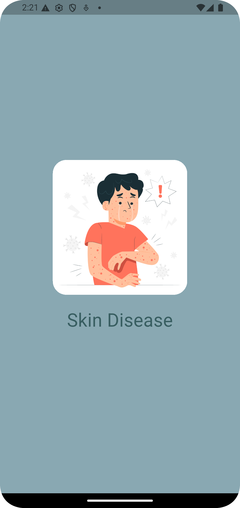
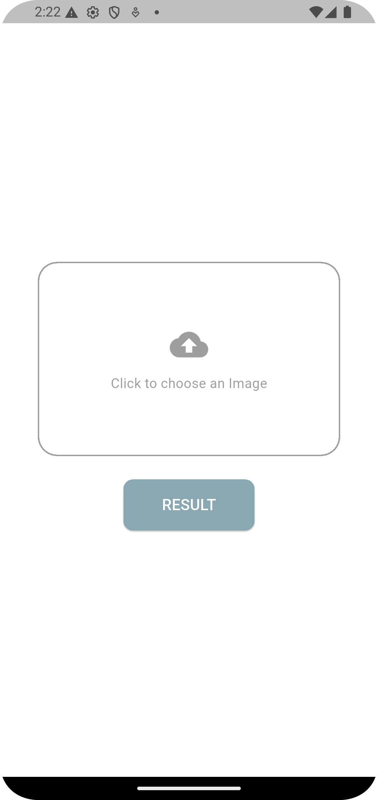
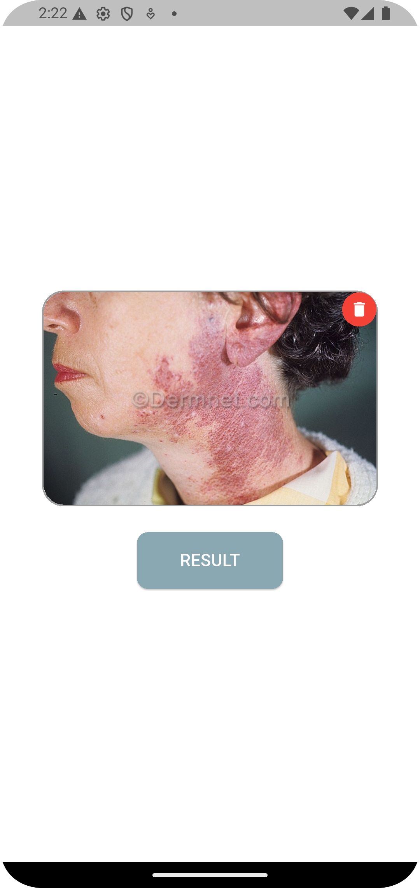
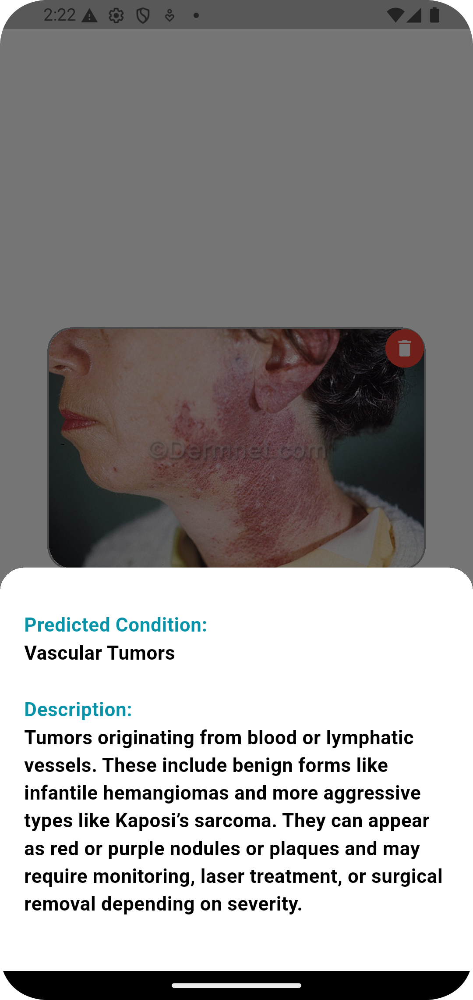

# 🩺 Skin Disease App

A Flutter application that helps users **identify common skin diseases** by uploading photos for **AI-powered analysis**.  
The app predicts possible skin conditions and provides **medical insights** and guidance based on the detected type.


---

## 🧭 Overview

**Skin Disease Detector** uses artificial intelligence to analyze skin images and predict possible conditions.  
Users can simply upload or capture a photo of a skin area, and the AI model will analyze it to suggest potential diseases — along with general medical information and recommendations.


---

## ✨ Key Features


- 🤳 **AI Image Analysis:** Upload or capture a skin photo to detect possible diseases.  
- 💡 **Medical Insights:** Get educational information about the detected condition.  
- ⚙️ **Cubit State Management:** Smooth and reactive state handling with Flutter Bloc.  
- 🌐 **Clean & Modern UI:** Simple interface focused on accessibility and ease of use.

---

## 🧠 AI Integration

The app uses a **deep learning model** trained on dermatology datasets to identify common skin diseases (like eczema, psoriasis, acne, etc.).  
The AI runs through a backend API or TensorFlow Lite (for offline prediction).

**Tech Stack for AI:**
- Python / TensorFlow  
- FastAPI / Flask (for API integration)  
- TFLite (for local on-device prediction)

---

## 🛠️ Tech Stack

| Layer                | Technology     |
|----------------------|----------------|
| **Frontend**         | Flutter (Dart) |
| **State Management** | Bloc / Cubit   |

---

## 📸 Screenshots





 
Example sections:
```
📱 Home Screen – Categories  
📸 AI Identification – Upload Photo  
📄 Details Page – Full Information  
```

---

## 🚀 Getting Started

### 1. Clone the Repository
```bash
git clone https://github.com/soha131/skin_disease.git
```

### 2. Install Dependencies
```bash
flutter pub get
```

### 3. Run the App
```bash
flutter run
```

> Make sure your environment is set up with Flutter SDK.

---

## 🧩 Folder Structure

```
lib/
│
├── core/
│   ├── service/
│   ├── models/
│   └── cubit/
│
├── features/
│   ├── splash/
│   └── upload_image/
│   
│
└── main.dart
```

---


## 📅 Future Enhancements

- 🏥 Add direct links to dermatologists or clinics. 
- 📊 Include charts to track user skin progress.
- 🔊 Add voice input for accessibility.

---

## 🤝 Contributing

Contributions are welcome!  
Please open an issue or submit a pull request to help improve the project.

---

## 📄 License

This project is licensed under the **MIT License** — feel free to use and modify it.

---
